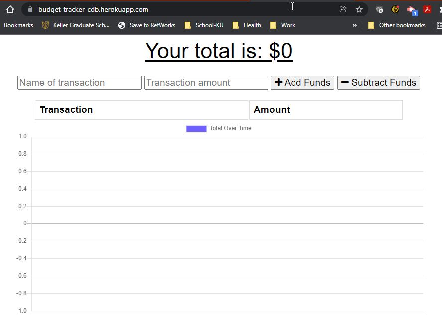

# Progressive Web Applications (PWA): Budget Tracker

## Description

Giving users a fast and easy way to track their money is important, but allowing them to access that information at any time is even more important. Having offline functionality is paramount to the success of an application that handles users’ financial information.

This application does just that, allowing users to add expenses and deposits to their budget with or without a connection. Users also receive a running total and are able to access the functional, deployed application on Heroku.

[back to top](#table-of-contents)

## Table of Contents

[Description](#description) | [Installation](#installation) | [Review](#review) | [Usage](#usage) | [License](#license) | [Contributing](#contributing) | [Tests](#tests) | [Questions](#questions)

## Installation

To install necessary dependencies into the node_modules folder, run the following command:

```
npm i
```

[back to top](#table-of-contents)

## Review

**_Acceptance Criteria/Pseudocode_**

- [User Story and Acceptance Criteria](./docs/acceptance-criteria.md)

**_Functional, Deployed Application_**

- [Click to Run Application](https://budget-tracker-cdb.herokuapp.com/)

**_Mock-up and Walk-through Animation_**

- Home Screen:
  

- Online Demo:</br>
  

- Offline Demo:</br>
  

**_GitHub Repository_**

- [GitHub Repository URL](https://github.com/christinedbaxter/budget-tracker)

[back to top](#table-of-contents)

## Usage

The application is invoked by navigating to the following URL:

```
https://budget-tracker-cdb.herokuapp.com/
```

Project folder structure:

```
.
├── docs/           // documentation and application mockups/animations
├── models/         // transaction entry Mongoose database schema
├── public/         // html, css, js, manifest.json, and service-worker.js needed for application
├── routes/         // API routes/paths
├── .gitignore      // indicates folders/files Git should ignore
├── server.js       // API interactions, database connection, and server start
└── package.json
```

[back to top](#table-of-contents)

## License

This project is licensed under the MIT license.

[back to top](#table-of-contents)

## Contributing

[](./docs/code_of_conduct.md#top)

To help make community values explicit, and signal commitment to creating a welcoming and safe environment for everyone, the [Contributor Covenant](./docs/code_of_conduct.md) has been adopted.

[back to top](#table-of-contents)

## Tests

No tests created for this project.

[back to top](#table-of-contents)

## Questions

If you have any questions about the repo, open an issue or contact me directly at christine.d.baxter@live.com. You can find more of my work at [christinedbaxter](https://github.com/christinedbaxter/).

[back to top](#table-of-contents)
